# 🚀 KCI Open API-Based Local LLM & RAG Research Assistant System

This repository provides a hybrid RAG (Retrieval-Augmented Generation) pipeline environment integrating the KCI (Korea Citation Index) Open API with local AI inference infrastructure.
It maintains strict API key security and decoupled architecture while providing a full-stack research assistant powered by a local Llama 3.1 8B model.

## 🛠️ Tech Stack

- **Frontend**: Streamlit
- **Backend**: Python 3.10+, FastAPI, LangChain
- **Vector DB**: ChromaDB (Local In-Memory / Persistent Vector Store)
- **Embedding**: HuggingFace (`sentence-transformers/paraphrase-multilingual-MiniLM-L12-v2`)
- **Inference**: Local LLM (Llama 3.1 8B via LM Studio REST API)

## 📐 System Architecture

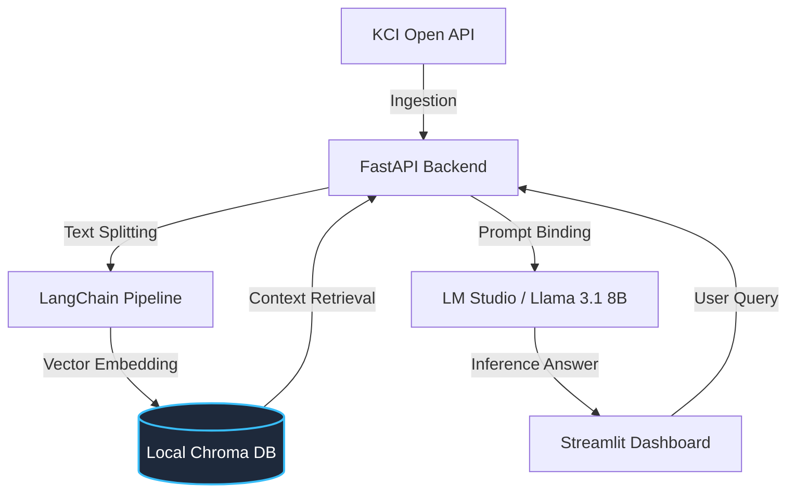

## 📚 KCI Academic RAG Assistant
An experimental RAG (Retrieval-Augmented Generation) pipeline designed to ingest, process, and query domestic academic research data via official API integrations.

## 🏗️ Architecture & Data Pipeline
This project establishes a data-driven pipeline leveraging official research data portals to test retrieval accuracy and context extraction in a localized LLM environment.

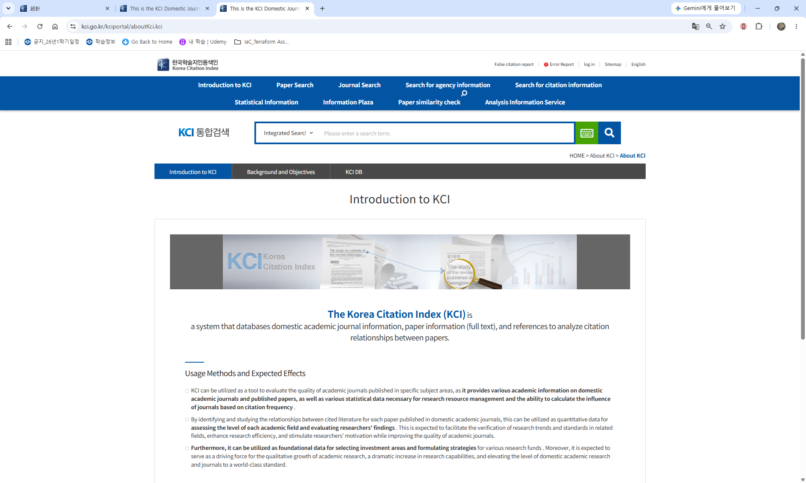
https://www.kci.go.kr/kciportal/aboutKci.kci

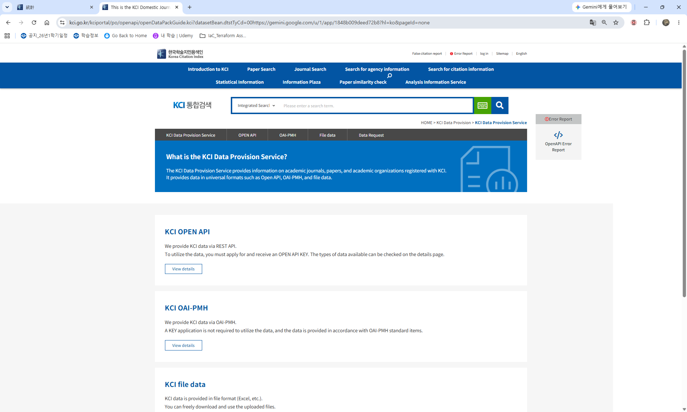
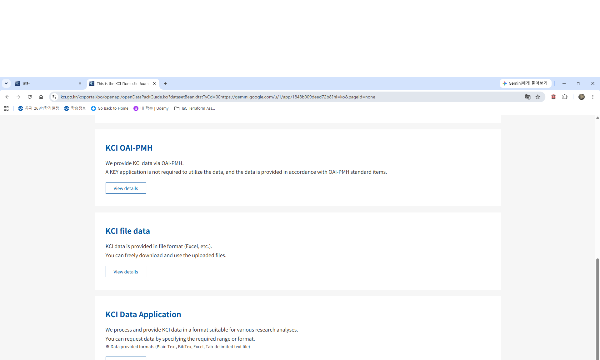
https://www.kci.go.kr/kciportal/po/openapi/openDataPackGuide.kci?datasetBean.dtstTyCd=00https://gemini.google.com/u/1/app/1848b009deed72b8?hl=ko&pageId=none

[ KCI Open API / OAI-PMH ] ---> (Data Ingestion & Schema Mapping) ---> [ Vector Embedding & Local LLM ] ---> (Context Retrieval & RAG Generation)


## 📂 Project Directory Structure

```text
├── backend/
│   ├── app/
│   │   ├── api/v1/       # FastAPI router endpoints (/api/v1/rag/query)
│   │   ├── core/         # RAG chain pipeline & configuration
│   │   ├── schemas/      # Pydantic request/response schemas
│   │   ├── services/     # KCI API Client & Vector DB management
│   │   └── main.py       # FastAPI application entrypoint
│   ├── tests/            # pytest unit and integration test suite
│   ├── run_e2e_rag.py    # Standalone E2E verification script
│   └── requirements.txt
├── frontend/
│   └── app.py            # Streamlit interactive UI dashboard
├── docs/                 # AI orchestration and audit log documentation
└── scripts/
    └── sync_to_public.ps1 # Public portfolio code sanitization script
```

## ⚙️ Quick Start (Local Execution)

### 1. Prerequisites (Launch LM Studio Local Server)
* Launch LM Studio and load the **Llama 3.1 8B (Q8_0)** model.
* Navigate to the **Developer (↔)** tab and start the `Local Server` (Default port: `1234`).

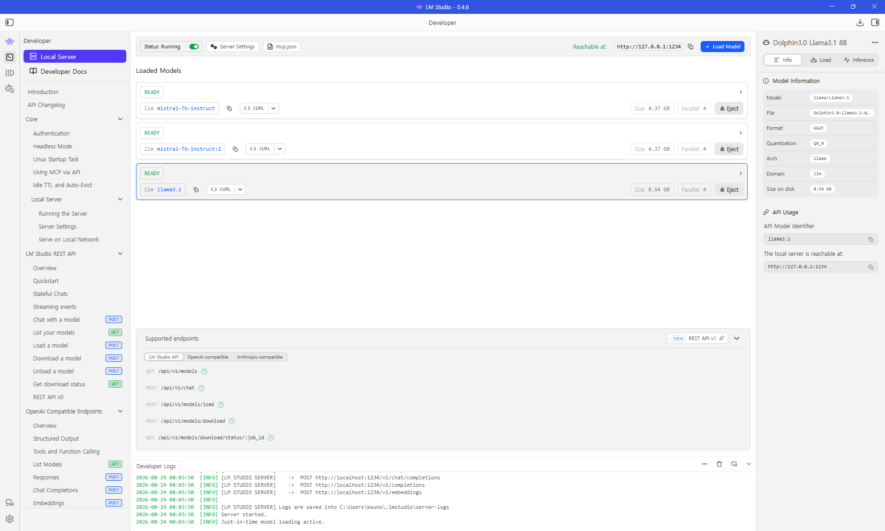

### 2. Virtual Environment Setup & Dependencies
```powershell
cd backend
.\venv\Scripts\Activate.ps1
pip install -r requirements.txt
```

### 3. Verification Suite (Micro V-Model Unit Tests)
```powershell
python -m pytest tests/ -v
```
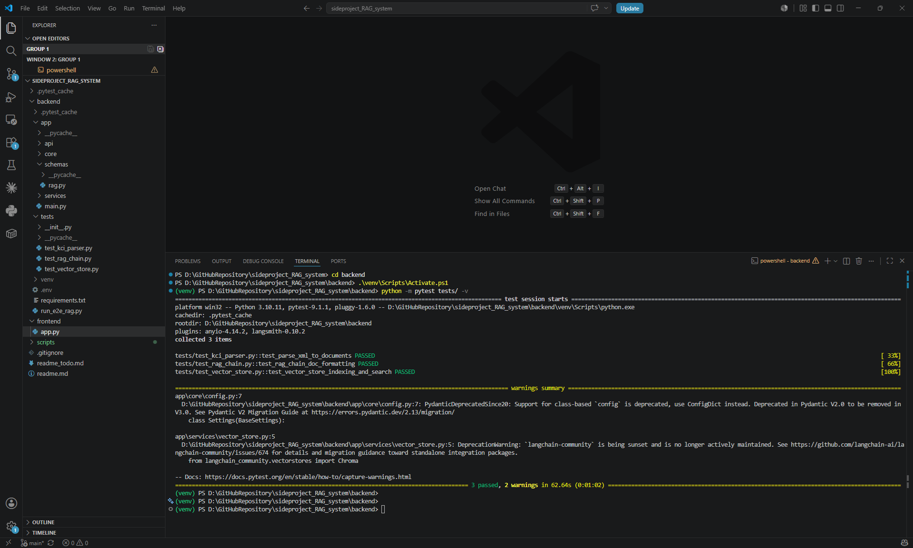

### 4. Application Launch

* **Terminal 1 (FastAPI Backend):**
  ```powershell
  fastapi dev app/main.py
  ```
  *(Interactive API Docs: `http://127.0.0.1:8000/docs`)*

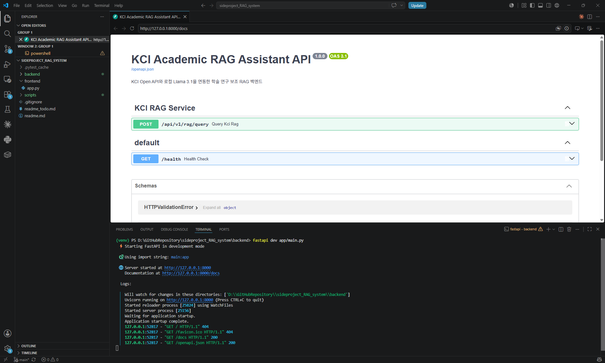
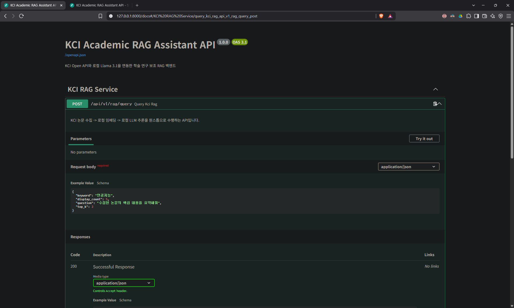
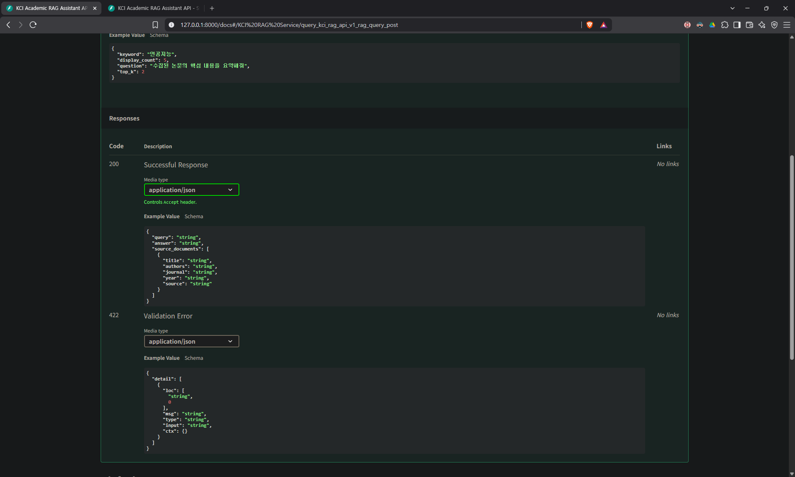

* **Terminal 2 (Streamlit Frontend):**
  ```powershell
  streamlit run ../frontend/app.py
  ```
  *(Web Dashboard: `http://localhost:8501`)*

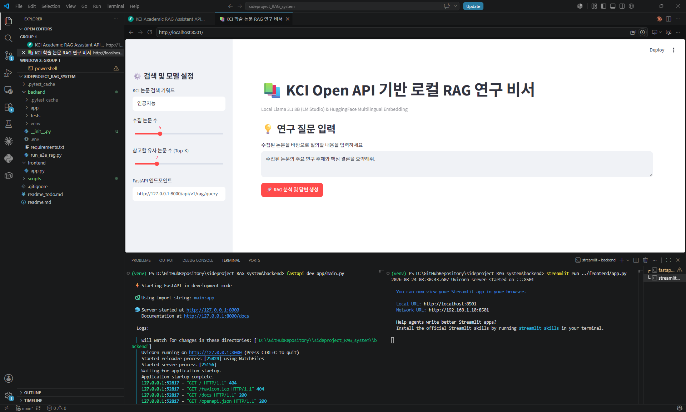
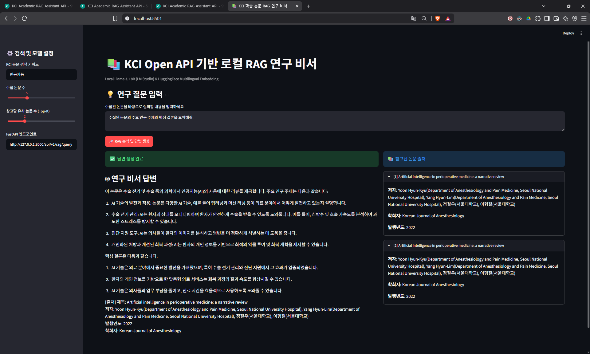
