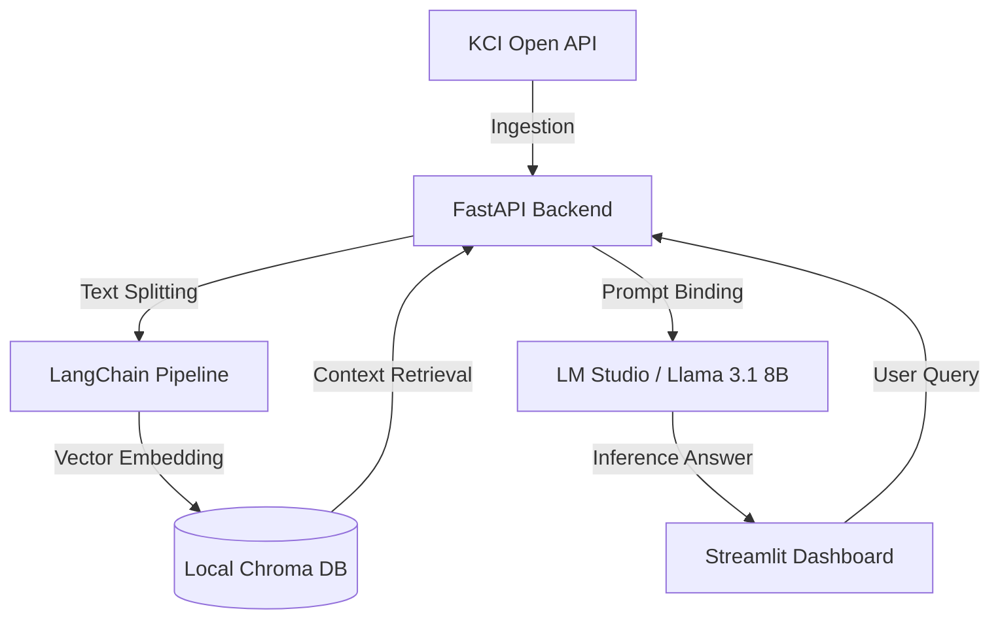

# 🚀 KCI Open API 기반 로컬 LLM & RAG 연구 비서 시스템 (Private)

본 레포지토리는 KCI Open API 및 로컬 인프라를 활용한 하이브리드 RAG 시스템의 핵심 백엔드/프론트엔드 파이프라인 개발 환경입니다.
인증키 보안을 유지하며 로컬 Llama 3.1과 결합된 연구 비서 풀스택을 제공합니다.

## 🛠️ Tech Stack

- **Frontend**: Streamlit
- **Backend**: Python 3.10+, FastAPI, LangChain
- **Vector DB**: ChromaDB (Local In-Memory / Vector Store)
- **Embedding**: HuggingFace (`paraphrase-multilingual-MiniLM-L12-v2`)
- **Inference**: Local LLM (Llama 3.1 8B via LM Studio REST API)[cite: 4]

## 📐 System Architecture



## 📂 Project Directory Structure

```text
├── backend/
│   ├── app/
│   │   ├── api/v1/       # FastAPI 라우터 (/api/v1/rag/query)
│   │   ├── core/         # RAG 체인 및 시스템 설정
│   │   ├── schemas/      # Pydantic 요청/응답 스키마
│   │   ├── services/     # KCI API Client & Vector DB
│   │   └── main.py       # FastAPI 진입점
│   ├── tests/            # pytest 단위/통합 테스트
│   ├── run_e2e_rag.py    # E2E 파이프라인 검증 CLI
│   └── requirements.txt
├── frontend/
│   └── app.py            # Streamlit 대시보드 UI
├── docs/                 # AI 오케스트레이션 및 감사 로그
└── scripts/
    └── sync_to_public.sh # Public 포트폴리오 동기화 스크립트
```

## ⚙️ Quick Start (Local Execution)

### 1. 사전 준비 (LM Studio 서버 가동)
* LM Studio 실행 후 **Llama 3.1 8B (Q8_0)** 모델 로드
* **Developer (↔)** 탭에서 `Local Server` 가동 (기본 포트 `1234`)

### 2. 가상환경 설정 및 패키지 설치
```powershell
cd backend
.\venv\Scripts\Activate.ps1
pip install -r requirements.txt
```

### 3. 단위 테스트 검증
```powershell
python -m pytest tests/ -v
```

### 4. 서버 및 대시보드 동시 실행

* **터미널 1 (FastAPI 백엔드):**
  ```powershell
  fastapi dev app/main.py
  ```
  *(API Docs: `http://127.0.0.1:8000/docs`)*

* **터미널 2 (Streamlit 프론트엔드):**
  ```powershell
  streamlit run ../frontend/app.py
  ```
  *(Web UI: `http://localhost:8501`)*